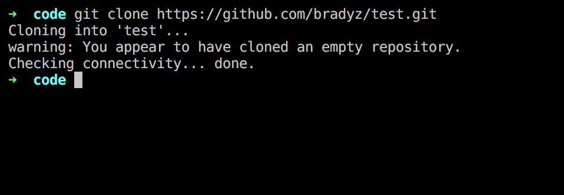
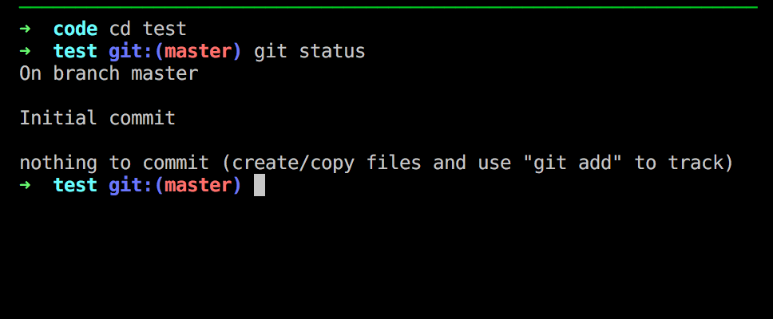
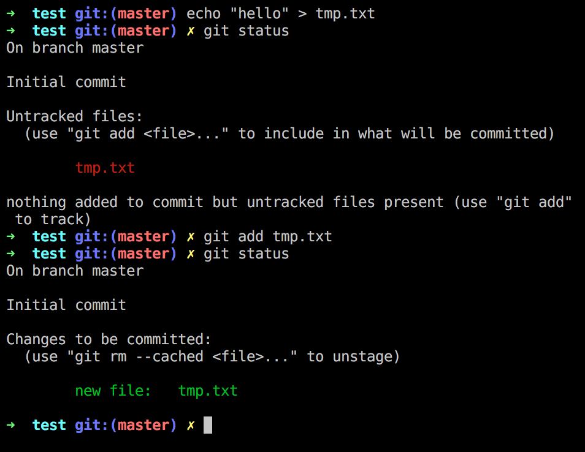
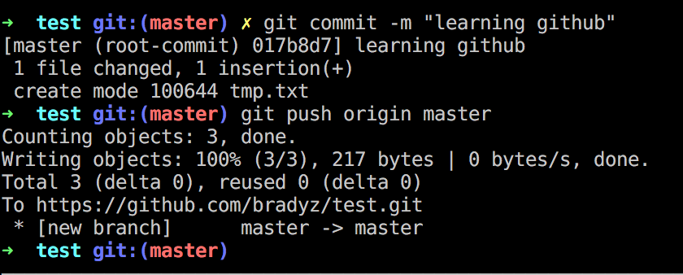
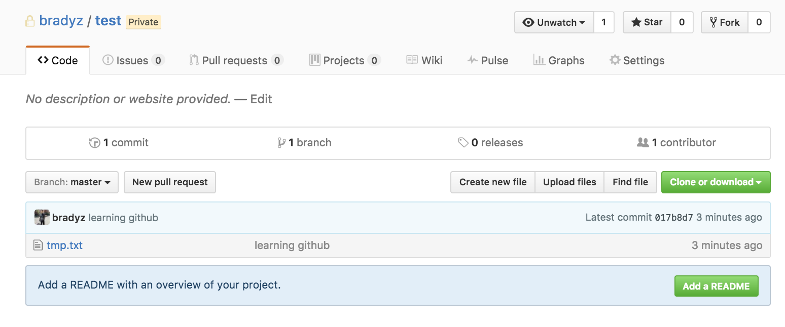

## Git/Github Tutorial

### Git/Github Background

Git is a program run locally that allows you to save revisions (past versions) of code. Github will host the files online.

### Git Workflow

Create an account and a repository through the online site.

Next, you want to **clone** or copy this onto your local machine.

Copy the url from the repository.


Next, you want to open up a terminal and navigate to some directory you would like this repo to live in.



Now move into that directory and run **git status**.



This will show you the files that have been modified.

Let's add a new file and **add** it.



Now **commit** the changes, this means to enter a checkpoint mark and enter a message with the "-m" flag.

After committing, we will **push** the changes to github. We have to specify the **branch** name, and destination. For now, just remember the following -

```bash
git push origin master
```



Now let's go back to Github and check out the new changes.



### Terminology

**repository** - a project or collection of files.

**merge conflict** - revisions are out of sync, you and another teammate changed the same files and now you have to choose which one to use.

### Commands

Note the things prefixed with $ are placeholders.

**git status** - look at updated files.

**git add $FILENAME** - add a updated file to be checkpointed later.

**git commit -m "$MESSAGE"** - add a new checkpoint with some message.

**git clone** - copy a repo.

**git pull origin master** - get the newest main version.

**git push origin master** - add new changes to the main version.
